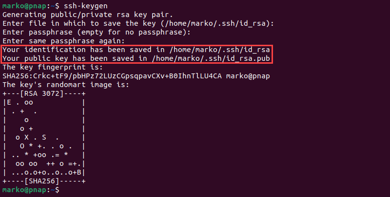

# Step-by-Step Implementation on Huawei Cloud

## Region and Availability Zones
- **Region:** `ap-southeast-2` (AP-Bangkok)
- **Availability Zones:**
  - `ap-southeast-2a` = AC1
  - `ap-southeast-2b` = AC2
  - `ap-southeast-2c` = AZ3 **(preferred)**

### Implementation Steps
```markdown
1. Create KMS (Key Management Service) 
  - Key Algorithm and Usage AES_256 | ENCRYPT_DECRYPT
2. Create CSMS (Cloud Secret Management Service)
  - Create Secret key for store private.pem
3. Create KPS (Key Pair Service)
  - apply use KMS and CSM
```
## Generate SSH Key Pair
1. Create a directory named .ssh in the home directory. The -p option ensures the system does not return an error if the directory exists:
```bash
mkdir -p $HOME/.ssh
```
2. Change permissions of the directory to give the user read, write, and execute privileges:
```bash
chmod 0700 $HOME/.ssh
```
3. Execute the ssh-keygen command to create an RSA key pair:
*Alternatively, create keys using the RSA 4096 encryption for extra security
```bash
ssh-keygen -t rsa -b 4096
```
4. When prompted, provide the path to the key file. If you press Enter without typing a file path, the key will be stored in the .ssh directory under the default file name id_rsa. 

5. The system asks you to create a passphrase as an added layer of security. Input a memorable passphrase, and press Enter.
The output shows that the keys have been created successfully.


6. Copy Public Key Manually
 - Use the following command to display the public key:
  ```bash
  cat ~/.ssh/id_rsa.pub
  ```
 - Copy public to Keypair
 7. Add Secret key private_ssh_keypair and paste  Private.pem value to CSMS
